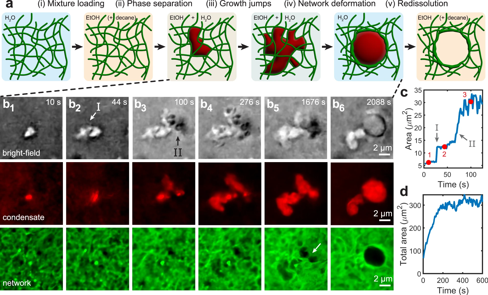
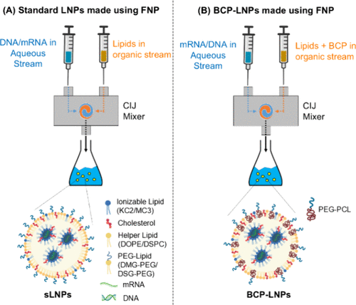
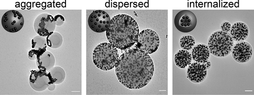
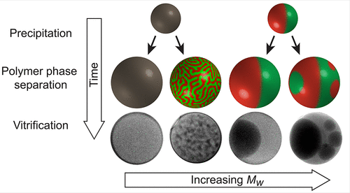
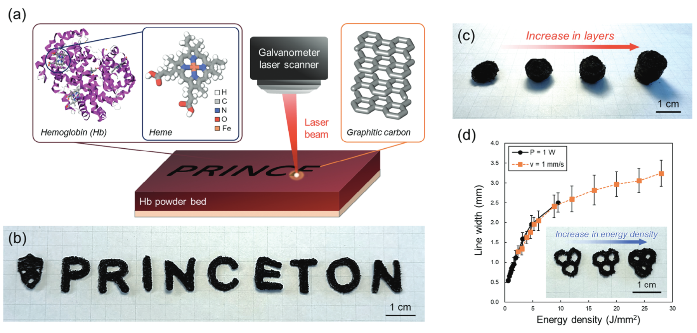
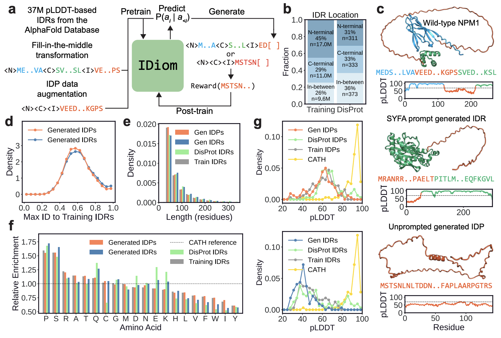

# Jason X. Liu

## About

| Postdoctoral Research Fellow in Chemical Engineering at Stanford University. I study the assembly and processing of soft materials, with applications ranging from targeted drug delivery to sustainable manufacturing. Previously, I completed my PhD and MA in Mechanical Engineering at Princeton University, and my BA in Physics at UC Berkeley.  [GitHub](https://github.com/jxliu2) [Google Scholar](https://scholar.google.com/citations?user=8ePDvssAAAAJ&hl=en) [LinkedIn](https://www.linkedin.com/in/jason-liu-aba40a104/) |  |
|---|---|

---

## Research

|  | **Liquid–liquid phase separation within fibrillar networks** JX Liu, MP Haataja, A Košmrlj, SS Datta, CB Arnold, RD Priestley *Nature Communications*, 2023  Formation of polymer-rich domains in soft materials through spinodal decomposition and phase separation. |
|---|---|

|  | **Synthesizing lipid nanoparticles by turbulent flow in confined impinging jet mixers** SN Subraveti, BK Wilson, N Bizmark, J Liu, RK Prud'homme *JoVE (Journal of Visualized Experiments)*, 2024  High-throughput synthesis of lipid nanoparticles for drug delivery applications using microfluidic mixing. |
|---|---|

|  | **Tuning Morphologies and Reactivities of Hybrid Organic–Inorganic Nanoparticles** J Schneider, JX Liu, VE Lee, RK Prud'homme, SS Datta, RD Priestley *ACS Nano*, 2022  Control of nanoparticle architecture through tailored polymer stabilizers in precipitation processes. |
|---|---|

|  | **Evolution of polymer colloid structure during precipitation and phase separation** JX Liu, N Bizmark, DM Scott, RA Register, MP Haataja, SS Datta, RK Prud'homme, RD Priestley *JACS Au*, 2021  Time-resolved characterization of colloidal aggregation and phase behavior in polymer solutions. |
|---|---|

|  | **Laser upcycling of hemoglobin protein biowaste into engineered graphene aerogel architectures for 3D supercapacitors** S Hayashi, M Rupp, JX Liu, JW Stiles, A Das, A Sanchirico, S Moore, CB Arnold *Advanced Science*, 2025  Sustainable approach to converting protein waste into functional carbon materials for energy storage. |
|---|---|

|  | **Generative design of intrinsically disordered protein regions with IDiom** J Liu, S Ibarraran, F Hu, A Park, A Dunn, G Rotskoff *bioRxiv*, 2026  Machine learning framework for designing flexible protein regions with tunable phases and interactions. |
|---|---|
